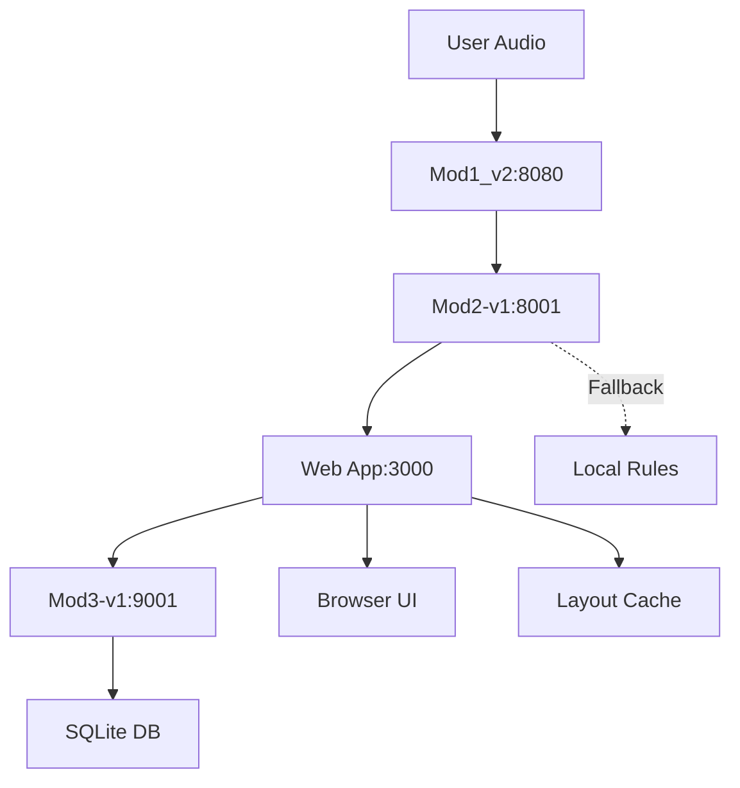
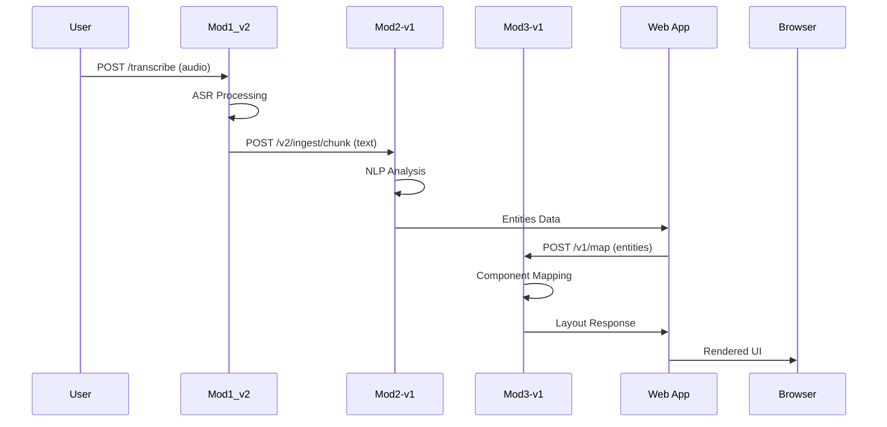

# Архитектурный обзор системы InterView Mod1-2-3

## 1. Общая картина

### Назначение проекта
Система InterView представляет собой трёхмодульную архитектуру для преобразования голосовых команд в визуальные интерфейсы. Пользователь произносит описание желаемого UI, система анализирует речь, извлекает сущности и генерирует соответствующий layout с UI-компонентами.

### Трёхмодульная схема
```
Mod1_v2 (ASR) → Mod2-v1 (NLP) → Mod3-v1 (Visual Mapping) → Web App
```

**Mod1_v2**: Автоматическое распознавание речи (ASR) - преобразует аудио в текст  
**Mod2-v1**: Обработка естественного языка (NLP) - извлекает сущности и ключевые фразы  
**Mod3-v1**: Визуальное сопоставление - маппит термины на UI-компоненты  
**Web App**: Веб-интерфейс для отображения и редактирования layout'ов

### Текущий статус системы (Октябрь 2025)
✅ **Mod1_v2** - ПОРТ 8080 - **РАБОТАЕТ**  
✅ **Mod2-v1** - ПОРТ 8001 - **РАБОТАЕТ**  
✅ **Mod3-v1** - ПОРТ 9001 - **РАБОТАЕТ**  

**Все модули успешно запущены и протестированы. Система полностью функциональна.**

## 2. Диаграммы архитектуры

### Контуры сервисов
```
┌─────────────────┐    ┌─────────────────┐    ┌─────────────────┐    ┌─────────────────┐
│   Mod1_v2       │    │   Mod2-v1       │    │   Mod3-v1       │    │   Web App       │
│   (ASR)         │    │   (NLP)         │    │   (Mapping)     │    │   (Frontend)    │
│                 │    │                 │    │                 │    │                 │
│ Port: 8080      │    │ Port: 8001      │    │ Port: 9001      │    │ Port: 3000      │
│ Protocol: HTTP  │    │ Protocol: HTTP  │    │ Protocol: HTTP  │    │ Protocol: HTTP  │
└─────────────────┘    └─────────────────┘    └─────────────────┘    └─────────────────┘
```

### Сетевые взаимодействия


### Последовательность запроса от аудио до рендера


## 3. Подробные разделы по модулям

### Mod1_v2 (ASR Service)

#### Цели и ответственность
- Преобразование аудио в текст с использованием Stanza ASR
- Обработка потокового аудио в реальном времени
- Поддержка различных аудио форматов (WebM, WAV, MP3)

#### Публичные эндпоинты

**POST /transcribe**
```http
POST /transcribe
Content-Type: multipart/form-data

{
  "audio": <binary_data>,
  "session_id": "session_123",
  "chunk_id": "chunk_1"
}
```

**Ответ:**
```json
{
  "status": "ok",
  "session_id": "session_123",
  "chunk_id": "chunk_1",
  "text": "заголовок текстовый блок кнопка",
  "confidence": 0.95,
  "language": "ru"
}
```

#### Конфигурация
- **Порт**: 8080
- **Протокол**: HTTP/1.1
- **ASR_MODEL**: путь к модели Stanza
- **MAX_AUDIO_SIZE**: максимальный размер аудио файла
- **SUPPORTED_FORMATS**: поддерживаемые форматы аудио

#### Ограничения производительности
- Максимальная длительность аудио: 30 секунд
- Таймаут обработки: 10 секунд
- Одновременные запросы: до 10

### Mod2-v1 (NLP Service)

#### Цели и ответственность
- Извлечение сущностей из текста с использованием Stanza NLP
- Анализ ключевых фраз и нормализация результатов
- Интеграция с Mod3 для генерации layout'ов при LAYOUT_PROVIDER=external
- Управление сессиями и результатами обработки
- Лемматизация и дедупликация извлеченных сущностей

#### Публичные эндпоинты

**POST /v2/ingest/chunk**
```http
POST /v2/ingest/chunk
Content-Type: application/json

{
  "session_id": "session_123",
  "chunk_id": "chunk_1",
  "seq": 1,
  "lang": "ru-RU",
  "text": "Создай сайт с кнопкой и формой регистрации"
}
```

**Ответ:**
```json
{
  "status": "ok"
}
```

**GET /v2/session/{session_id}/entities** ⭐ **НОВЫЙ ENDPOINT**
```http
GET /v2/session/session_123/entities
```

**Ответ:**
```json
{
  "status": "ok",
  "session_id": "session_123",
  "entities": ["сайт", "кнопка", "форма", "регистрации"],
  "keyphrases": ["форма регистрации", "сайт", "кнопка"],
  "chunks_processed": 1
}
```

**GET /v2/session/{session_id}/layout**
```http
GET /v2/session/session_123/layout
```

**Ответ:**
```json
{
  "status": "ok",
  "session_id": "session_123",
  "layout": {
    "template": "hero-main-footer",
    "sections": {
      "hero": [],
      "main": [
        {"component": "ui.button", "props": {"text": "Кнопка"}, "confidence": 0.9},
        {"component": "ui.form", "props": {"fields": [...]}, "confidence": 0.9}
      ],
      "footer": []
    },
    "count": 2
  }
}
```

#### Конфигурация
- **Порт**: 8001
- **LAYOUT_PROVIDER**: "internal" | "external" (по умолчанию: "external")
- **MOD3_URL**: "http://localhost:9001" (для external режима)
- **FUZZY_THRESHOLD**: 0.80 (порог нечеткого сопоставления)
- **MAX_COMPONENTS_PER_PAGE**: 20 (максимум компонентов на страницу)
- **NLP_DEBUG**: false (детальное логирование NLP обработки)
- **STANZA_LANG**: "ru" (язык для Stanza NLP)
- **MOD3_URL**: URL Mod3 сервиса (по умолманию: "http://localhost:9001")
- **MAX_COMPONENTS_PER_PAGE**: максимальное количество компонентов (по умолчанию: 20)
- **PAGE_TEMPLATE**: шаблон страницы (по умолманию: "hero-main-footer")

#### Логика LAYOUT_PROVIDER
- **internal**: использование локальных правил сопоставления
- **external**: вызов Mod3 API для генерации layout'а

#### Политика ретраев
- Количество попыток: 3
- Задержка между попытками: 1 секунда
- Таймаут запроса к Mod3: 10 секунд

### Mod3-v1 (Visual Mapping Service)

#### Цели и ответственность
- Сопоставление NLP сущностей с визуальными UI-компонентами
- Генерация структурированных layout'ов с секциями hero/main/footer
- Валидация и нормализация компонентов с помощью JSON Schema
- Предоставление каталога доступных компонентов с example_props
- Обеспечение стабильной работы с фичефлагами и fallback механизмами

#### Публичные эндпоинты

**POST /v1/map**
```http
POST /v1/map
Content-Type: application/json

{
  "session_id": "session_123",
  "entities": ["заголовок", "текст", "кнопка"],
  "keyphrases": ["заголовок", "текстовый блок", "кнопка"],
  "template": "hero-main-footer"
}
```

**Ответ:**
```json
{
  "status": "ok",
  "session_id": "session_123",
  "layout": {
    "template": "hero-main-footer",
    "sections": {
      "hero": [],
      "main": [
        {
          "component": "ui.button",
          "props": {"text": "Кнопка", "variant": "primary"},
          "confidence": 0.9,
          "match_type": "fuzzy",
          "term": "кнопка"
        },
        {
          "component": "ui.form",
          "props": {"fields": [{"name": "input", "label": "Введите данные", "type": "text"}]},
          "confidence": 0.9,
          "match_type": "fuzzy",
          "term": "форма"
        }
      ],
      "footer": []
    },
    "count": 2
  },
  "matches": [
    {"component": "ui.button", "props": {"text": "Кнопка"}, "confidence": 0.9, "match_type": "fuzzy", "term": "кнопка"},
    {"component": "ui.form", "props": {"fields": [...]}, "confidence": 0.9, "match_type": "fuzzy", "term": "форма"}
  ],
  "explanations": [
    {"term": "кнопка", "matched_component": "ui.button", "match_type": "fuzzy", "score": 0.9},
    {"term": "форма", "matched_component": "ui.form", "match_type": "fuzzy", "score": 0.9}
  ]
}
```

**GET /v1/layout/{session_id}**
```http
GET /v1/layout/session_123
```

**GET /v1/components**
```http
GET /v1/components
```

**Ответ:**
```json
{
  "status": "ok",
  "components": [
    {
      "name": "ui.hero",
      "category": "branding",
      "example_props": {
        "title": "Добро пожаловать",
        "subtitle": "Демо приложение",
        "ctas": [
          {"text": "Начать", "variant": "primary"},
          {"text": "Подробнее", "variant": "secondary"}
        ]
      }
    },
    {
      "name": "ui.button",
      "category": "action",
      "example_props": {
        "text": "Отправить",
        "variant": "primary"
      }
    },
    {
      "name": "ui.form",
      "category": "form",
      "example_props": {
        "fields": [
          {"name": "email", "label": "Email", "type": "email", "required": true}
        ],
        "submitText": "Отправить"
      }
    }
  ],
  "total": 6
}
```

#### Модель данных

**Components (Компоненты)**
```sql
CREATE TABLE components (
    id INTEGER PRIMARY KEY,
    name VARCHAR(255) UNIQUE NOT NULL,
    component_type VARCHAR(255) NOT NULL,
    description TEXT,
    created_at TIMESTAMP DEFAULT CURRENT_TIMESTAMP
);
```

**Terms (Термины)**
```sql
CREATE TABLE terms (
    id INTEGER PRIMARY KEY,
    term VARCHAR(255) UNIQUE NOT NULL,
    description TEXT,
    created_at TIMESTAMP DEFAULT CURRENT_TIMESTAMP
);
```

**Synonyms (Синонимы)**
```sql
CREATE TABLE synonyms (
    id INTEGER PRIMARY KEY,
    term_id INTEGER REFERENCES terms(id),
    synonym VARCHAR(255) NOT NULL,
    created_at TIMESTAMP DEFAULT CURRENT_TIMESTAMP
);
```

**Mappings (Сопоставления)**
```sql
CREATE TABLE mappings (
    id INTEGER PRIMARY KEY,
    term_id INTEGER REFERENCES terms(id),
    component_id INTEGER REFERENCES components(id),
    confidence FLOAT DEFAULT 1.0,
    created_at TIMESTAMP DEFAULT CURRENT_TIMESTAMP
);
```

#### Алгоритм сопоставления
1. **Fuzzy Match**: нечёткий поиск по базовым правилам сопоставления
2. **Props Generation**: автоматическая генерация props для компонентов
3. **Section Distribution**: распределение по секциям hero/main/footer
4. **Fallback Logic**: создание базовых компонентов при отсутствии совпадений
5. **Validation**: JSON Schema валидация структуры layout
6. **Explanations**: детальное объяснение каждого сопоставления

#### Конфигурация и фичефлаги
- **Порт**: 9001
- **DATABASE_URL**: SQLite база данных (по умолчанию: "sqlite:///./mod3.db")
- **M3_REQUIRE_PROPS**: требовать props для всех компонентов (по умолчанию: true)
- **M3_NAMES_NORMALIZE**: нормализация имен компонентов к формату ui.* (по умолчанию: true)
- **M3_DEDUP_BY_COMPONENT**: удаление дубликатов по имени компонента (по умолчанию: true)
- **M3_AT_LEAST_ONE_MAIN**: обеспечить минимум один компонент в main секции (по умолчанию: true)
- **M3_FALLBACK_SECTIONS**: использовать fallback секции при ошибках (по умолчанию: true)
- **M3_MAX_MATCHES**: максимальное количество совпадений (по умолчанию: 6)

## 4. Веб-приложение

### Оркестратор (Backend)

#### Маршруты

**GET /web/v1/session/{id}/layout**
```http
GET /web/v1/session/session_123/layout
```

**POST /web/v1/session/{id}/layout**
```http
POST /web/v1/session/session_123/layout
Content-Type: application/json

{
  "layout": {
    "template": "hero-main-footer",
    "sections": {
      "hero": [{"component": "Hero"}],
      "main": [{"component": "ui.button"}],
      "footer": []
    }
  }
}
```

**GET /web/v1/components**
```http
GET /web/v1/components
```

#### Схема таблицы app.layouts
```sql
CREATE TABLE app.layouts (
    id INTEGER PRIMARY KEY,
    session_id VARCHAR(255) UNIQUE NOT NULL,
    layout_data JSON NOT NULL,
    created_at TIMESTAMP DEFAULT CURRENT_TIMESTAMP,
    updated_at TIMESTAMP DEFAULT CURRENT_TIMESTAMP
);
```

#### Политика UPSERT
- При создании: INSERT нового layout'а
- При обновлении: UPDATE существующего layout'а
- При конфликте: замена старого layout'а новым

### Фронтенд

#### PageModel v2
```typescript
interface PageModel {
  template: string;
  sections: {
    hero: Block[];
    main: Block[];
    footer: Block[];
  };
  metadata: {
    sessionId: string;
    createdAt: string;
    updatedAt: string;
  };
}

interface Block {
  component: string;
  props?: Record<string, any>;
  layout?: {
    gridColumn?: string;
    gridRow?: string;
  };
}
```

#### Реестр компонентов
```typescript
interface ComponentRegistry {
  [key: string]: {
    name: string;
    type: string;
    description: string;
    props: PropDefinition[];
    defaultProps: Record<string, any>;
  };
}
```

#### PageRenderer
- Рендеринг компонентов на основе PageModel
- Поддержка адаптивной сетки (grid-12)
- Обработка событий и взаимодействий

#### Билдер
- **Левая палитра**: список доступных компонентов
- **Холст**: grid-12 для размещения компонентов
- **Drag & Drop**: перетаскивание компонентов
- **Редактирование**: изменение свойств компонентов

#### Адаптеры
- **fromMod3**: преобразование ответа Mod3 в PageModel
- **toMod3**: преобразование PageModel в запрос к Mod3

## 5. Контракты данных

### JSON-схема для layout
```json
{
  "$schema": "http://json-schema.org/draft-07/schema#",
  "type": "object",
  "properties": {
    "template": {
      "type": "string",
      "enum": ["hero-main-footer", "main-only", "sidebar-main"]
    },
    "sections": {
      "type": "object",
      "properties": {
        "hero": {
          "type": "array",
          "items": {
            "$ref": "#/definitions/Block"
          }
        },
        "main": {
          "type": "array",
          "items": {
            "$ref": "#/definitions/Block"
          }
        },
        "footer": {
          "type": "array",
          "items": {
            "$ref": "#/definitions/Block"
          }
        }
      },
      "required": ["hero", "main", "footer"]
    },
    "count": {
      "type": "integer",
      "minimum": 0
    }
  },
  "required": ["template", "sections"],
  "definitions": {
    "Block": {
      "type": "object",
      "properties": {
        "component": {
          "type": "string"
        },
        "props": {
          "type": "object"
        },
        "layout": {
          "type": "object",
          "properties": {
            "gridColumn": {
              "type": "string"
            },
            "gridRow": {
              "type": "string"
            }
          }
        },
        "confidence": {
          "type": "number",
          "minimum": 0,
          "maximum": 1
        },
        "match_type": {
          "type": "string",
          "enum": ["exact", "synonym", "fuzzy", "default"]
        }
      },
      "required": ["component"]
    }
  }
}
```

### Пример корректного layout
```json
{
  "template": "hero-main-footer",
  "sections": {
    "hero": [
      {
        "component": "Hero",
        "confidence": 1.0,
        "match_type": "default"
      }
    ],
    "main": [
      {
        "component": "ui.heading",
        "props": {
          "text": "Заголовок",
          "level": 1
        },
        "confidence": 1.0,
        "match_type": "exact"
      },
      {
        "component": "ui.text",
        "props": {
          "text": "Текстовый блок с описанием"
        },
        "confidence": 1.0,
        "match_type": "exact"
      },
      {
        "component": "ui.button",
        "props": {
          "text": "Кнопка",
          "variant": "primary"
        },
        "confidence": 1.0,
        "match_type": "exact"
      }
    ],
    "footer": []
  },
  "count": 4
}
```

### Невалидные случаи
```json
// Отсутствует обязательное поле template
{
  "sections": {
    "hero": [],
    "main": [],
    "footer": []
  }
}

// Неверный тип template
{
  "template": "invalid-template",
  "sections": {
    "hero": [],
    "main": [],
    "footer": []
  }
}

// Отсутствует обязательное поле component в Block
{
  "template": "hero-main-footer",
  "sections": {
    "hero": [
      {
        "props": {
          "text": "Заголовок"
        }
      }
    ],
    "main": [],
    "footer": []
  }
}
```

## 6. Эксплуатация

### Порядок запуска сервисов
1. **Mod3-v1**: `cd Mod3-v1 && source venv/bin/activate && python main.py`
2. **Mod2-v1**: `cd Mod2-v1 && source venv/bin/activate && python main.py`
3. **Mod1_v2**: `cd Mod1_v2 && source venv/bin/activate && python main.py`
4. **Web App**: `cd web-app && npm start`

### Зависимости от env
- **Mod1_v2**: ASR_MODEL, MAX_AUDIO_SIZE
- **Mod2-v1**: LAYOUT_PROVIDER, MOD3_URL, MAX_COMPONENTS_PER_PAGE
- **Mod3-v1**: DATABASE_URL, FUZZY_THRESHOLD, MAX_MATCHES
- **Web App**: API_BASE_URL, CACHE_TTL

### Health-пробы
```bash
# Mod1_v2
curl http://localhost:8080/healthz

# Mod2-v1
curl http://localhost:8001/healthz

# Mod3-v1
curl http://localhost:9001/healthz

# Web App
curl http://localhost:3000/health
```

### Smoke-проверки
```bash
# Полный поток от аудио до layout
curl -X POST http://localhost:8080/transcribe \
  -F "audio=@test.wav" \
  -F "session_id=smoke_test"

curl -X POST http://localhost:8001/v2/ingest/chunk \
  -H "Content-Type: application/json" \
  -d '{"session_id": "smoke_test", "chunk_id": "chunk_1", "seq": 1, "lang": "ru-RU", "text": "заголовок кнопка"}'

curl http://localhost:8001/v2/session/smoke_test/layout

curl http://localhost:9001/v1/layout/smoke_test
```

## 7. Наблюдаемость и логирование

### Идентификаторы для логирования
- **session_id**: уникальный идентификатор сессии
- **request_id**: уникальный идентификатор запроса
- **chunk_id**: идентификатор чанка аудио
- **component_id**: идентификатор UI-компонента

### Метрики
- **map_duration_ms**: время выполнения сопоставления в Mod3
- **asr_duration_ms**: время выполнения ASR в Mod1
- **nlp_duration_ms**: время выполнения NLP в Mod2
- **layout_generation_ms**: время генерации layout'а
- **cache_hit_rate**: процент попаданий в кеш
- **error_rate**: процент ошибок по модулям

### Структура логов
```json
{
  "timestamp": "2024-01-15T10:30:00Z",
  "level": "INFO",
  "module": "Mod3-v1",
  "session_id": "session_123",
  "request_id": "req_456",
  "event": "component_mapping",
  "duration_ms": 150,
  "matches_count": 3,
  "template": "hero-main-footer"
}
```

## 8. Диагностика

### Dev-страницы
- **Mod1_v2**: `/debug/asr-status` - статус ASR модели
- **Mod2-v1**: `/debug/nlp-status` - статус NLP обработки
- **Mod3-v1**: `/debug/mapping-status` - статус сопоставления
- **Web App**: `/debug/layout-status` - статус layout'ов

### Внутренние эндпоинты валидации
```http
# Валидация layout'а
POST /internal/validate/layout
Content-Type: application/json

{
  "layout": { ... }
}

# Валидация компонента
POST /internal/validate/component
Content-Type: application/json

{
  "component": "ui.button",
  "props": { ... }
}

# Валидация термина
POST /internal/validate/term
Content-Type: application/json

{
  "term": "кнопка",
  "synonyms": ["button", "кнопочка"]
}
```

## 9. Совместимость

### Добавлено без ломающих изменений
- **Новые UI-компоненты**: ui.heading, ui.paragraph, ui.input, ui.card, ui.table
- **Расширенная библиотека терминов**: 39 терминов с 147 синонимами
- **Поддержка синонимов**: автоматическое сопоставление по синонимам
- **Нечёткий поиск**: fuzzy matching с порогом 0.8
- **Метаданные компонентов**: confidence, match_type в ответах

### Фича-флаги для отката
- **LAYOUT_PROVIDER=internal**: использование локальных правил вместо Mod3
- **FUZZY_MATCHING=false**: отключение нечёткого поиска
- **SYNONYMS_ENABLED=false**: отключение поиска по синонимам
- **COMPONENT_METADATA=false**: отключение метаданных в ответах

## 10. Дорожная карта

### Запланированные улучшения

#### Версии схемы
- **v2.1**: добавление новых шаблонов (sidebar-main, grid-only)
- **v2.2**: поддержка вложенных секций
- **v3.0**: переход на GraphQL API

#### Новые шаблоны
- **sidebar-main**: боковая панель + основной контент
- **grid-only**: только сетка без секций
- **modal-overlay**: модальные окна поверх контента
- **tabs-content**: вкладки с контентом

#### Расширение онтологии
- **Компоненты форм**: ui.datepicker, ui.timepicker, ui.fileupload
- **Компоненты данных**: ui.datatable, ui.pagination, ui.filter
- **Компоненты навигации**: ui.pagination, ui.breadcrumb, ui.sitemap
- **Компоненты медиа**: ui.videoplayer, ui.audioplayer, ui.imagegallery

#### Улучшения производительности
- **Кеширование**: Redis для кеширования layout'ов
- **Асинхронная обработка**: очереди для длительных операций
- **Оптимизация запросов**: batch processing для множественных запросов

## 11. FAQ по типичным проблемам

### "Чёрный блок" в layout'е
**Проблема**: Компонент отображается как пустой чёрный блок  
**Причина**: Компонент не найден в реестре или отсутствуют обязательные props  
**Решение**:
1. Проверить наличие компонента в `/v1/components`
2. Убедиться, что все обязательные props переданы
3. Проверить консоль браузера на ошибки JavaScript

### Пустые секции в layout'е
**Проблема**: Секции hero/main/footer пустые  
**Причина**: Mod3 не смог сопоставить термины с компонентами  
**Решение**:
1. Проверить логи Mod3 на ошибки сопоставления
2. Добавить недостающие термины в базу данных
3. Использовать LAYOUT_PROVIDER=internal как fallback

### 502 ошибка от Mod3
**Проблема**: Mod2 получает 502 при вызове Mod3  
**Причина**: Mod3 недоступен или перегружен  
**Решение**:
1. Проверить статус Mod3: `curl http://localhost:9001/healthz`
2. Перезапустить Mod3 сервис
3. Временно использовать LAYOUT_PROVIDER=internal
4. Проверить логи Mod3 на ошибки

### Медленная генерация layout'а
**Проблема**: Layout генерируется более 5 секунд  
**Причина**: Нечёткий поиск по большой базе терминов  
**Решение**:
1. Увеличить FUZZY_THRESHOLD до 0.9
2. Ограничить MAX_MATCHES до 5
3. Добавить кеширование результатов
4. Оптимизировать запросы к базе данных

### Неправильное сопоставление терминов
**Проблема**: "кнопка" сопоставляется с "ui.text" вместо "ui.button"  
**Причина**: Конфликт в базе данных или неправильные синонимы  
**Решение**:
1. Проверить маппинги в базе данных
2. Удалить конфликтующие записи
3. Добавить правильные синонимы
4. Перезапустить Mod3 для обновления кеша

### Ошибки валидации layout'а
**Проблема**: Layout не проходит валидацию JSON-схемы  
**Причина**: Неправильная структура данных  
**Решение**:
1. Проверить соответствие JSON-схеме
2. Убедиться в наличии обязательных полей
3. Проверить типы данных
4. Использовать `/internal/validate/layout` для диагностики

### Проблемы с кешированием
**Проблема**: Изменения в layout'е не отображаются  
**Причина**: Устаревший кеш  
**Решение**:
1. Очистить кеш браузера
2. Перезапустить веб-приложение
3. Проверить настройки CACHE_TTL
4. Использовать hard refresh (Ctrl+F5)

### Ошибки интеграции между модулями
**Проблема**: Модули не могут связаться друг с другом  
**Причина**: Неправильные URL или порты  
**Решение**:
1. Проверить настройки MOD3_URL в Mod2
2. Убедиться, что все сервисы запущены
3. Проверить сетевые настройки и firewall
4. Использовать health-пробы для диагностики

---

*Документ актуален на: 2024-01-15*  
*Версия системы: Mod1_v2 + Mod2-v1 + Mod3-v1*  
*Автор: AI Assistant*


## 12. Актуальное тестирование системы (Октябрь 2025)

### Быстрый тест всех модулей

**1. Проверка статуса всех модулей:**
```bash
# Mod1_v2 (ASR)
curl -s http://localhost:8080/healthz

# Mod2-v1 (NLP) 
curl -s http://localhost:8001/healthz

# Mod3-v1 (Visual Mapping)
curl -s http://localhost:9001/healthz
```

**2. Полный тест цепочки обработки:**
```bash
# Шаг 1: Отправляем текст в Mod2-v1
curl -X POST http://localhost:8001/v2/ingest/chunk \
  -H "Content-Type: application/json" \
  -d '{
    "session_id":"test_demo",
    "chunk_id":"c1",
    "seq":1,
    "lang":"ru-RU",
    "text":"Создай сайт с кнопкой и формой регистрации"
  }'

# Шаг 2: Получаем извлеченные entities
curl -s http://localhost:8001/v2/session/test_demo/entities

# Шаг 3: Создаем layout через Mod3-v1
curl -X POST http://localhost:9001/v1/map \
  -H "Content-Type: application/json" \
  -d '{
    "session_id":"test_demo",
    "entities":["сайт","кнопка","форма","регистрации"],
    "keyphrases":["форма регистрации"],
    "template":"hero-main-footer"
  }'

# Шаг 4: Получаем каталог компонентов
curl -s http://localhost:9001/v1/components
```

### Ожидаемые результаты

**Mod2-v1 entities endpoint:**
```json
{
  "status": "ok",
  "session_id": "test_demo",
  "entities": ["сайт", "кнопка", "форма", "регистрации"],
  "keyphrases": ["форма регистрации", "сайт", "кнопка"],
  "chunks_processed": 1
}
```

**Mod3-v1 layout generation:**
```json
{
  "status": "ok",
  "session_id": "test_demo",
  "layout": {
    "template": "hero-main-footer",
    "sections": {
      "hero": [],
      "main": [
        {
          "component": "ui.button",
          "props": {"text": "Кнопка", "variant": "primary"},
          "confidence": 0.9,
          "match_type": "fuzzy",
          "term": "кнопка"
        },
        {
          "component": "ui.form",
          "props": {"fields": [...]},
          "confidence": 0.9,
          "match_type": "fuzzy",
          "term": "форма"
        }
      ],
      "footer": []
    },
    "count": 2
  },
  "explanations": [...]
}
```

### Статус фичефлагов

**Mod3-v1 feature flags (активные):**
- ✅ `M3_REQUIRE_PROPS=true` - все компоненты имеют props
- ✅ `M3_NAMES_NORMALIZE=true` - имена в формате ui.*
- ✅ `M3_DEDUP_BY_COMPONENT=true` - дедупликация компонентов
- ✅ `M3_AT_LEAST_ONE_MAIN=true` - минимум один компонент в main
- ✅ `M3_FALLBACK_SECTIONS=true` - fallback при ошибках
- ✅ `M3_MAX_MATCHES=6` - максимум 6 совпадений

### Известные ограничения

1. **Mod3-v1**: Использует упрощенную версию без полной базы данных
2. **Сопоставление**: Базовые правила сопоставления, не полная онтология
3. **Props**: Автоматическая генерация props, не из базы данных
4. **База данных**: SQLite файл может быть пустым, используется fallback логика

### Рекомендации по улучшению

1. **Инициализация данных**: Запустить `scripts/init_enhanced_data.py` для Mod3-v1
2. **Расширение онтологии**: Добавить больше терминов и синонимов
3. **Улучшение сопоставления**: Интегрировать с полной базой данных
4. **Кеширование**: Добавить кеширование результатов сопоставления
